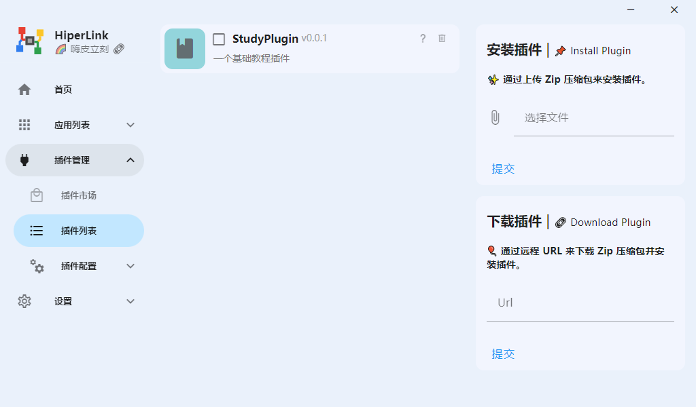

# 创建插件

::: tip
如果您是 `Golang` 的使用者，我们推荐您下载插件模板：

Gitee: https://gitee.com/HiperLink/example-plugins

Github: https://github.com/Hiper-Link/example-plugins
:::

插件的基本组织形式为`文件夹`，一个文件夹即为一个插件。

插件所需要用到的一切都可以放进这个文件夹中。

现在，让我们制作一个名为`StudyPlugin`的插件。

首先我们需要一个`唯一ID`，这将会成为你插件的标志。在这里我们将`StudyPlugin`的唯一ID设定为`study_plugin`。

然后我们需要进行三步：

>1. 创建一个名为 `study_plugin` 的文件夹
>
>2. 在文件夹中创建 `metadata.json` 文件
>
>3. 将文件夹移动到HiperLink下的plugins文件夹（如果没有就新建）

目录在此时应该是这样的：

```
│ HiperLink.exe
├─config
├─libs        
├─logs
└─plugins
    ├─study_plugin
        ├─metadata.json
```

此时你的插件还无法被识别，因为我们需要编写metadata.json的内容。

metadata.json 的基础模板如下：

``` json
{
    "id": "",
    "version": "",
    "name": "",
    "description": "",
    "author": [""],
    "link": "",
    "dependencies": {
        "hiperlink": ">=1.0.0"
    },
    "command": "",
    "args": [],
    "type": "gRPC",
    "root": false,
    "color": "",
    "icon": "",
    "frontend": {
        "ui": true,
        "configuration": true
    }
}
```
- id：插件ID,该值要与文件夹名称保持一致。
- version：插件版本
- name：插件名称
- description：插件描述
- author：插件作者，该值为数组，可以容纳多个作者
- link：插件的网站链接
- command：插件的运行指令，如`./plugin`，`python plugin.py`，`java -jar plugin.jar`等。
- args：插件的指令参数
- type：插件类型，目前可选的值只有`gRPC`与`netRPC`
- root：插件是否需要使用管理员权限运行，该值为布尔值
- color: 插件图标的颜色，为十六进制颜色码(#FFFFFF)和RGB颜色码()。颜色的选择可以参考[中国色](http://zhongguose.com)
- icon：插件图标，该值为`mdi-` + [Material Design Icons](https://materialdesignicons.com/)上的所有可选图标代码，如`mdi-user-arrow-left-outline`
- ui：是否显示主页按钮
- configuration：是否显示配置按钮

在本案例中，metadata.json的内容应该是：

``` json
{
    "id": "study_plugin",
    "version": "0.0.1",
    "name": "StudyPlugin",
    "description": "一个基础教程插件",
    "author": ["天机"],
    "link": "hiper.ink",
    "dependencies": {
        "hiperlink": ">=1.0.0"
    },
    "command": "",
    "args": [],
    "type": "gRPC",
    "root": false,
    "color": "#93d5dc",
    "icon": "mdi-book",
    "frontend": {
        "ui": true,
        "configuration": true
    }
}
```

command 将会在后面的教程中填写，现在让我们打开 HiperLink，看看插件是否能被识别。



看起来很不错，但是需要注意：该插件还无法启动，因为我们没有编写插件的本体：程序。

现在请看向左侧的“你好，世界！”条目，寻找你所使用的语言。